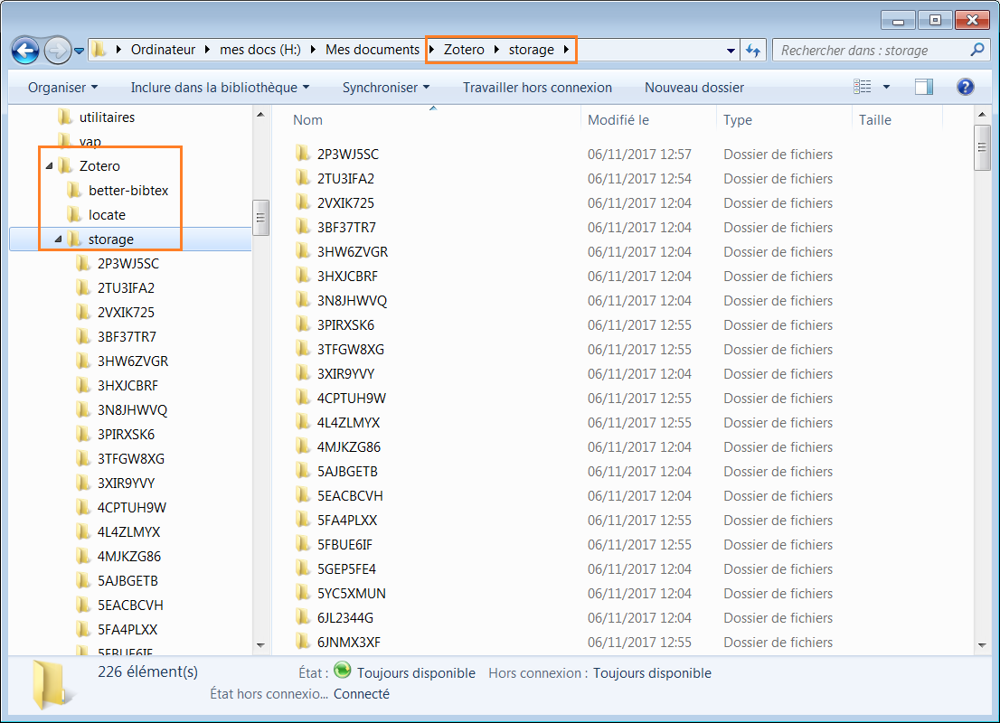
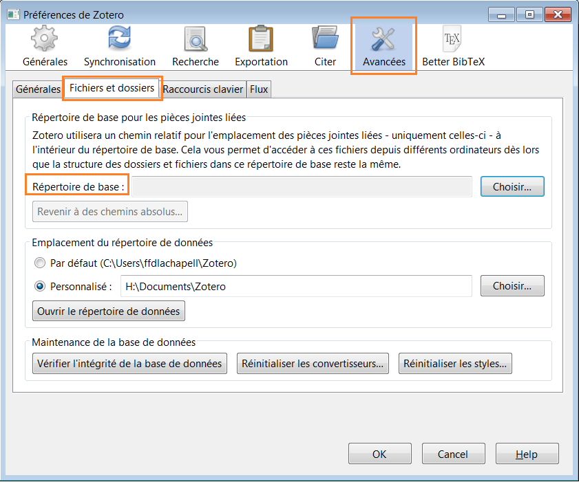
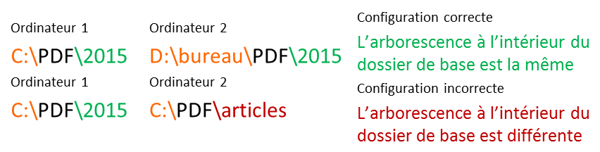
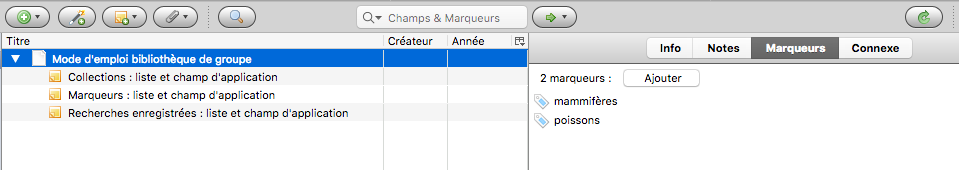
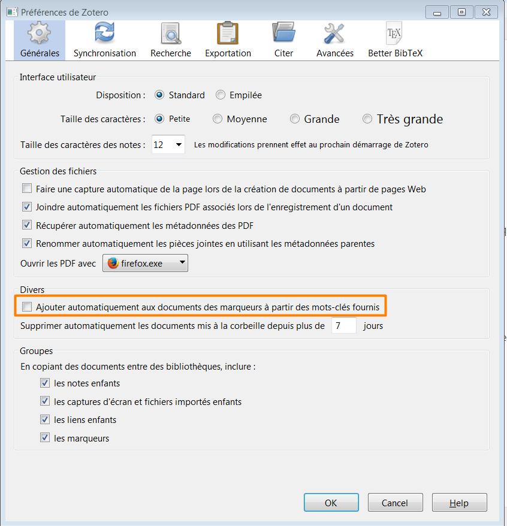
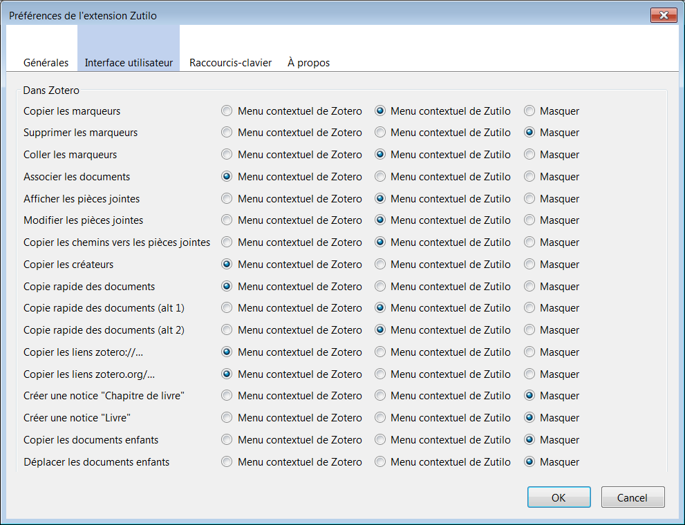
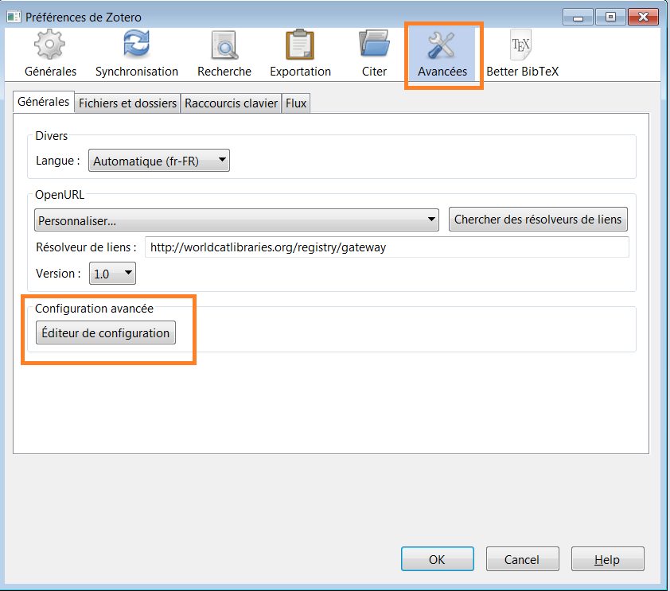
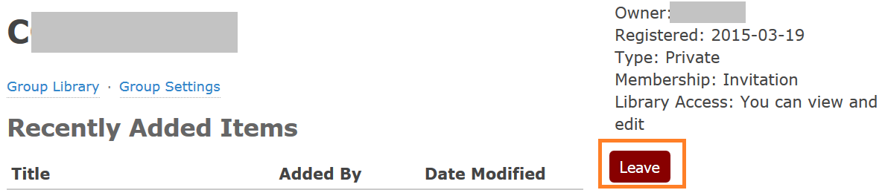
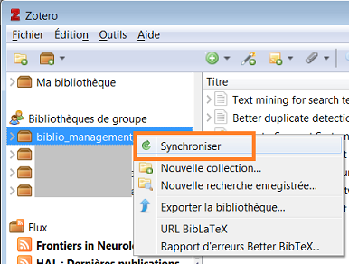

# Partager sa biblio : perfectionnement Zotero

# 1. Caractériser son projet

**Exercice 1 : caractérisez votre projet**

# 2. Créer un compte Zotero
La création d'un compte Zotero n'est pas obligatoire pour utiliser Zotero : vous pouvez installer Zotero sur tous vos ordinateurs sans avoir de compte Zotero. Le compte Zotero est nécessaire si vous souhaitez :

* **synchroniser** votre bibliothèque entre plusieurs ordinateurs,
* et/ou **partager** de la bibliographie avec des collègues, des étudiants, etc.

Si vous ne l'avez pas encore fait, c'est le moment d'y remédier!
Le lien en haut à droite de la page d'accueil du site Zotero donne accès au [formulaire d'enregistrement](https://www.zotero.org/user/register/) pour créer votre compte.

Voici un aperçu des paramètres.

* [Settings > Privacy](https://www.zotero.org/settings/privacy) : l'item _Publish entire library_ , décoché par défaut, rend votre bibliothèque lisible par tous sur Internet. Pourquoi ne pas utiliser cette simple option pour partager de la biblio? La visibilité n'est sélective ni en termes de **contenu** (c'est toute la bibliothèque ou rien), ni en termes de **périmètre d'accès** (c'est tout le monde ou personne), ni en termes d'**action** (les autres peuvent seulement lire et non modifier).
* [Settings > Storage](https://www.zotero.org/settings/storage) : outre l'option _Purge Storage_ qui vous permet de libérer votre espace de stockage en ligne de fichiers joints synchronisés à tort, ce menu vous permet d'acquérir de l'espace de stockage supplémentaire.

# 3. Créer et configurer un groupe Zotero adapté à ses besoins
Un groupe Zotero constitue un **espace à part**, distinct de sa bibliothèque personnelle.
Ajouter le même élément  dans sa bibliothèque personnelle et dans la bibliothèque de groupe revient à ajouter 2 objets, 2 occurrences distinctes du même élément ; supprimer l'un ne supprime pas l'autre.

[Documentation Zotero : Les groupes Zotero](https://www.zotero.org/support/fr/groups)

**Exercice 2 : créez et paramétrez un groupe associé à votre projet**

# 4. Paramétrer la synchronisation et gérer les fichiers joints

[Documentation Zotero : Synchronisation](https://www.zotero.org/support/fr/sync)

## Rappel : synchroniser et sauvegarder

[Documentation Zotero : Le répertoire de données Zotero](https://www.zotero.org/support/fr/zotero_data)

Si la synchronisation vous permet de disposer d'une copie en ligne de votre bibliothèque, elle ne constitue pas pour autant une solution de sauvegarde. Pour sauvegarder correctement vos données Zotero, il est nécessaire de sauvegarder le répertoire `Zotero`.

La synchronisation ne se substitue en effet pas à la sauvegarde : le serveur Zotero stocke uniquement une copie de la version la plus récente de votre bibliothèque, et cette copie peut être modifiée d'une simple (et éventuellement automatique) synchronisation.

## Question 1 : synchroniser tout ou partie de ses bibliothèques?
Une nouvelle fonctionnalité a été introduite par Zotero v5, la **synchronisation sélective**. Il est ainsi possible de choisir les bibliothèques à synchroniser :

* toutes ses bibliothèques,
* seulement sa bibliothèque personnelle
* seulement tout ou partie de ses bibliothèques de groupe.

## Question 2 : synchroniser les fichiers joints?
**Synchroniser ou non les fichiers joints va avoir un impact sur les modes de gestion de vos fichiers joints, et réciproquement.**

Si la synchronisation des données bibliographiques est très facile à paramétrer, celle des PDF et autres fichiers joints peut se révéler moins triviale. L'espace de stockage sur le serveur Zotero associé à chaque compte est en effet limité à **300 Mo** :  cette limite peut rapidement s'avérer insuffisante dès lors que l'on souhaite synchroniser des références bibliographiques ET des fichiers joints. Plusieurs options se présentent, correspondant à différents modes et choix de fonctionnement. En voici une première présentation succincte, nous les détaillerons ensuite.

* **Louer de l'espace de stockage sur le serveur Zotero** : en contrepartie d'une participation financière, la synchronisation est simple à mettre en oeuvre et pérenne. Zotero propose différentes offres pour étendre l'espace de stockage disponible, jusqu'à un **espace illimité** pour 120$ par an ; voir les [tarifs de l'espace de stockage sur le serveur Zotero](https://www.zotero.org/support/storage#storage_pricing).
* **Utiliser un serveur tiers pour les fichiers joints** : le coût financier peut être nul, mais l'organisation mise en place dépend alors des conditions d'utilisation du service choisi.
* **Ne pas synchroniser les fichiers joints**, voire ne pas synchroniser la bibliothèque : différentes méthodes permettent de transporter tout ou partie de sa bibliothèque aisément, sans recourir à un serveur en ligne.

## Rappel : gestion des fichiers joints dans Zotero

### Fonctionnement par défaut
Comme cela est détaillé dans [la page "Ajouter des fichiers à votre bibliothèque Zotero" de la documentation Zotero](https://www.zotero.org/support/fr/attaching_files), Zotero enregistre par défaut les fichiers joints dans son répertoire de données`Zotero`, dans un sous-répertoire `storage`. À l'intérieur de ce sous-répertoire `storage`, un nouveau répertoire au nom aléatoire est créé pour chaque pièce jointe.

### Zotfile?
Zotfile est un module complémentaire de Zotero développé par l'un de ses utilisateurs, [Joscha Legewie](https://github.com/jlegewie).

Il facilite la **gestion des fichiers joints** grâce aux fonctionnalités suivantes :

* renommage automatique et intelligent des fichiers,
* attachement du fichier le plus récemment modifié dans un répertoire déterminé,
* enregistrement des fichiers dans un répertoire déterminé, en dehors du répertoire `Zotero\storage`.

Un article détaillé lui est consacré : [lire le billet "ZotFile : un outil pour gérer vos PDF" sur le blog Zotero francophone](https://zotero.hypotheses.org/2838).

**Exercice 3 : installez et paramétrez ZotFile**

# 5. Synchroniser les fichiers joints : les différentes options en détails
## Spécificité des groupes
Les choix individuels que nous allons détailler ne sont pas forcément applicables pour les groupes.

* Discussion sur le forum Zotero [Group Sync | Network Storage](https://forums.zotero.org/discussion/comment/98067/)
* Rappel [Documentation Zotero : Synchronisation](https://www.zotero.org/support/fr/sync)

## Option 1 : enregistrer les fichiers joints dans le répertoire de données Zotero
### Avantages
* paramétrage minimal
* pas de risque de rupture de lien entre le élément Zotero et le fichier joint
* indexation du contenu des pièces jointes
* contribue à faciliter la sauvegarde et la portabilité sur 1 support (1 seul répertoire de données)
* synchronisation sélective
* stabilité du service

### Inconvénients
* fichiers difficilement accessibles sans utiliser Zotero...
* ... mais Zotero ne constitue-t-il pas un bon outil de navigation dans vos fichiers?
* ne permet pas de synchroniser vos fichiers joints si vous voulez utiliser Dropbox pour ce faire.

### Option 1.0 Dropbox
Une fausse bonne idée vous a peut-être traversé l'esprit : déplacer le répertoire `Zotero` en entier dans votre répertoire Dropbox pour tout synchroniser (les données bibliographiques et les fichiers joints) en même temps. Vous risquez en effet d'endommager irrémédiablement votre base de données, comme cela est expliqué en détails dans le fil de discussion [_Using Dropbox and want to move Zotero Data to it_](https://forums.zotero.org/discussion/25050/using-Dropbox-and-want-to-move-zotero-data-to-it) du forum Zotero, et sur le site [ZotPad](http://zotpad.uservoice.com/knowledgebase/articles/103395-what-is-a-symbolic-link-and-why-should-i-use-one-w).

Si vous souhaitez gérer vos PDF dans Zotero, privilégiez l'une des 3 options présentées _infra_. Si vous souhaitez utiliser Dropbox, il est préférable de gérer vos PDF avec Zotfile et suivre les indications de de l'option 2.

### Option 1.1 Zotero

**C'est la seule option possible pour synchroniser les pièces jointes d'une bibliothèque de groupe.**

Outre le choix de la ou des bibliothèques à synchroniser, vous pouvez paramétrer dans les _Préférences_ le téléchargement **systématique** ou **à la demande** des fichiers joints. Tous les fichiers joints sont bien transférés sur le serveur Zotero, mais ils ne sont téléchargés dans la bibliothèque locale que lorsqu'ils sont ouverts, _i. e._ "si nécessaire". Cela permet par exemple de réduire le temps de synchronisation d'une bibliothèque locale "secondaire" à partir de laquelle on ne recourt que ponctuellement aux PDF.

Dans le cas d'une bibliothèque de groupe, cela laisse la possibilité aux membres du groupe de ne télécharger qu'une partie des fichiers joints.

### Option 1.2 Serveur WebDAV tiers

**Cette option ne peut pas être utilisée pour une bibliothèque de groupe.**

Les fichiers joints gérés dans Zotero peuvent également être sauvegardés sur un serveur tiers en utilisant le protocole [WebDAV](http://doc.ubuntu-fr.org/webdav).
Outre les avantages liés à la gestion des PDF dans le répertoire de données Zotero détaillés _supra_, cette option présente également l'intérêt de ne pas nécessiter l'installation de logiciel complémentaire.

La page du site Zotero [List of WebDAV services](https://www.zotero.org/support/kb/webdav_services) recense divers services de stockage en ligne et de synchronisation utilisant ce protocole et compatibles avec Zotero, ([4shared](http://www.4shared.com/features.jsp) et [Box](https://www.box.com/fr_FR/pricing/personal/) par exemple). Cette page est mise à jour par les utilisateurs de Zotero, et Zotero ne peut s'engager sur aucun support à l'utilisation de ces services tiers.

Une fois paramétré le service que vous avez choisi, il suffit d'indiquer dans les _Préférences_ l'URL du serveur et vos identifiants pour ce service.

Si certaines universités comme Aix-Marseille et son [AMUbox](https://hs.hypotheses.org/460) offrent à leurs membres un espace WebDav utilisable pour la synchronisation des fichiers joints de bibliothèques personnelles, le recours à cette option s'avère impossible pour une bibliothèque de groupe, comme cela est détaillé notamment dans  la discussion du forum Zotero [Saving group libraries on a WebDAV server](https://forums.zotero.org/discussion/34481/saving-group-libraries-on-a-webdav-server).

### Option 1.3 Autre service

**Cette option ne peut pas être utilisée pour une bibliothèque de groupe.**

Une dernière option s'offre à vous : utiliser un serveur tiers n'utilisant pas le protocole WebDAV, à partir du moment où il vous permet de synchroniqer uniquement le répertoire `storage` à l'intérieur du répertoire `Zotero`. Synchroniser l'ensemble du répertoire `Zotero` est en effet une très mauvaise idée, comme détaillé _supra_ dans l'option 1.0.
Des services tels que [SpiderOak](https://spideroak.com) vous permettent de **sélectionner les répertoires à synchroniser à l'intérieur d'une arborescence**. SpiderOak garantit en outre **l'encryptage** de vos données.

## Option 2 : enregistrer les fichiers joints dans un répertoire de données en-dehors du répertoire Zotero

**Cette option ne peut pas être utilisée pour une bibliothèque de groupe.**

Discussions sur le forum Zotero :
* [Groups + Zotfile + Cloud attachments - doable?](https://forums.zotero.org/discussion/63237/groups-zotfile-cloud-attachments-doable)
* [How attach links to files using "link to URI" (in groups, zotero5)](https://forums.zotero.org/discussion/68075/how-attach-links-to-files-using-link-to-uri-in-groups-zotero5)

### Avantages
* accès aux fichiers indépendamment de Zotero
* permet d'utiliser Dropbox pour synchroniser les fichiers joints

### Inconvénients
* pas d'indexation du contenu des pièces jointes
* suppression des PDF doublon moins simple
* paramétrage et gestions des chemins relatifs

### Configuration
Gérer vos fichiers joints avec Zotfile vous permet de les enregistrer à l'emplacement de votre choix, dans des sous-répertoires signifiants (par année par exemple), et de les exploiter ainsi indépendamment de Zotero plus facilement.
Les données bibliographiques sont synchronisées par le serveur Zotero, mais il faut recourir à un serveur tiers pour les fichiers joints, Dropbox par exemple.
Cette option impose de veiller à **assurer la validité des liens** entre les éléments Zotero et les fichiers joints sur tous les ordinateurs synchronisés. Pour ce faire, vous devez :

* garder le même chemin sur tous les ordinateurs,
* ou utiliser des **chemins relatifs** gérés par Zotero.

Les chemins relatifs sont paramétrables dans les _Préférences_ de Zotero, en définissant un répertoire de base pour les fichiers joints.

Dans l'exmple suivant, le répertoire de base est `C:\PDF`.

**Le répertoire de base doit être le même que celui défini dans Zotfile.**

Si votre configuration de Zotfile implique la création de sous-répertoires, veillez à utiliser la **même arborescence** sur tous les ordinateurs que vous souhaitez synchroniser : la structure des répertoires à l'intérieur du répertoire de base doit être la même sur tous les ordinateurs.

En savoir plus sur les chemins relatifs dans Zotero :

adam3smith. (2013, 11 avril). What’s New in Zotero 4.0 - Part 2. _The Zoteroist_. Repéré à https://zoteromusings.wordpress.com/2013/04/11/whats-new-in-zotero-4-0-part-2/.

# 6. Organiser la bibliothèque de groupe

## Définir les règles de gestion des fichiers joints si applicable
Ces règles peuvent recouvrir notamment les aspects suivants.

* Quels types de fichier enregistre-t-on dans la bibliothèque? Limite-t-on les formats de fichier acceptés? _Cela relève de la bonne pratique et ne peut pas faire l'objet d'un paramétrage automatique contraignant._
* Quelles règles de nommage définit-on? L'utilisation de Zotfile (paramétré de la même façon par tous les membres du groupe) facilite l'adoption et l'application d'un schéma commun.
*  Qui a le droit d'éditer les fichiers? Seulement les administrateurs? Ou tous les membres du groupe?

## Déterminer et documenter un usage commun des outils d'organisation de la bibliothèque

De même que pour le nommage des fichiers, des règles d'organisation communes minimales permettront à votre bibliothèque de conserver sa cohérence et d'être plus aisément utilisable par tous les contributeurs. Que vous soyez adeptes des marqueurs, des collections ou des recherches enregistrées  - voir le billet du blog Zotero francophone [Comment organiser sa bibliothèque?](http://zotero.hypotheses.org/756) -, le plus important demeure d'**expliciter** et de **documenter** vos choix d'organisation, afin que chacun puisse se les approprier et surtout les appliquer.

Ce **mode d'emploi** peut efficacement prendre la forme d'un élément de la bibliothèque auquel seront attachés :

* une **note descriptive** pour les **collections**, comportant la liste des collections et détaillant le champ d'application de chacune d'elles,
* une **note descriptive** pour les **marqueurs**, comportant la liste des marqueurs et détaillant le champ d'application de chacun d'eux,
* une **note descriptive** pour les **recherches enregistrées**, comportant la liste des recherches enregistrées et détaillant le champ d'application de chacune d'elles,
* **tous les marqueurs utilisables** : cela permettra de disposer de l'ensemble des marqueurs dès la création de la bibliothèque, et évitera la suppression intempestive de l'un d'eux s'il n'est plus utilisé dans un élément.

_Un mode d'emploi compact et complet pour votre bibliothèque de groupe_

Pensez bien sûr à **actualiser** ce mode d'emploi au fur et à mesure de l'évolution de l'organisation de votre bibliothèque.

Si vous recourez aux **collections**, classer cet élément dans toutes les collections permettra à chacun de vérifier facilement le champ d'application de la collection en cours. Une alternative est la création d'une **note indépendante** pour chaque collection.

Afin que les principales règles d'organisation soient visibles de tous, n'hésitez pas à les reporter dans la _Description_ de votre groupe ; elles seront ainsi affichées lisiblement sur la **page web de votre groupe**.

Si vous utilisez ne serait-ce que minimalement les **marqueurs**, décocher la récupération automatique des marqueurs dans les préférences de Zotero évitera de parasiter la liste de vos marqueurs avec des mots clés inutiles.

_Préférences de Zotero : ne pas récupérer de marqueurs automatiquement_

Enfin, n'oubliez pas que les collections, les marqueurs et les recherches enregistrées peuvent non seulement organiser intellectuellement votre bibliothèque, mais aussi contribuer à sa bonne gestion et revêtir une fonction **utilitaire**. Une recherche enregistrée sur le critère _Type de fichier joint_ vous permettra par exemple de repérer rapidement les éléments pour lesquels aucun fichier n'est joint.

**Exercice 4 : créez le mode d'emploi de votre bibliothèque**

# 7. Alimenter la bibliothèque de groupe
## Alimenter la bibliothèque entre utilisateurs Zotero

### Rappel sur les modes d'alimentation d'une bibliothèque Zotero
Les sources à privilégier pour enregistrer des références les plus complètes possibles sont notamment :

* les sites des éditeurs,
* les bases de données bibliographiques,
* les catalogues de bibliothèque.

La récupération des métadonnées **à partir des identifiants** (DOI, PubMed, ISBN, arXiv) a une efficacité variable :

* ISBN : interrogation de WorldCat, tous les livres ne sont pas décrits avec la même précision,
* DOI : la complétude des métadonnées dépend des métadonnées que l'éditeur associe au DOI.
Ex : https://doi.org/10.1103/PhysRevLett.119.160401 - Il faudra compléter manuellement la pagination si on ajoute cet article par son DOI.

Si la version 5.0.36 de Zotero (mars 2018) a apporté un nouveau système de reconnaissance des fichiers PDF optimisant la récupération des métadonnées **à partir des PDF**, cette méthode n'est toutefois pas la plus fiable pour alimenter votre bibliothèque.

>_While this feature can greatly facilitate importing large existing libraries of PDFs, **it is not** the best way to add items to your library in general. Items can be imported faster by using the Zotero Connector plugin in your browser from publisher websites or most scholarly databases. This saves several steps versus downloading the PDF manually and adding it to Zotero. The item metadata will also often be higher quality. See [Getting Stuff into your Library](https://www.zotero.org/support/getting_stuff_into_your_library) for the best ways to add items to your library._

Source : [Documentation Zotero : Récupérer les métadonnées PDF - EN](https://www.zotero.org/support/retrieve_pdf_metadata)

Pour en savoir plus sur la version 5.0.36 de Zotero :

Collectif. (2018, 16 mars). Zotero 5.0.36 : du changement pour vos PDF et vos citations [Billet]. _Le blog Zotero francophone_. Repéré à https://zotero.hypotheses.org/1685

### Organisation des contributions
1.  Chacun des contributeurs membres du groupe Zotero doit avoir son propre compte Zotero : partager les identifiants d'un même compte posera immanquablement divers problèmes, notamment si les contributeurs qui utilisent le même compte souhaitent synchroniser leur bibliothèque personnelle.

2.  Déterminez **votre méthode d'alimentation** de la bibliothèque de groupe. Certains préfèrent enregistrer d'abord les éléments dans leur bibliothèque personnelle pour ajouter le texte intégral, les mots clés, etc. D'autres au contraire préfèreront conserver distinctes les deux bibliothèques et enregistreront directement les éléments à partager dans la bibliothèque du groupe.

### Travail collectif sur la qualité des données (complétude, exactitude)
1. Quelle que soit la méthode d'alimentation que vous adoptez, veillez à **corriger et compléter** si nécessaire les références bibliographiques ; Zotero peut vous aider pour certaines petites corrections, comme nous l'avons détaillé dans le billet du blog Zotero [Nettoyer les références collectées, quelques astuces](http://zotero.hypotheses.org/760).

2. Ne négligez pas la fonction **_Connexe_**, qui vous permet de lier plusieurs éléments Zotero entre eux. _Connexe_ relie ainsi les différentes versions d'une même oeuvre, les figures de l'article dans lequel elles sont insérées, etc. Dans le cadre d'un travail collaboratif, il indiquera surtout aux autres contributeurs les relations que vous avez établies entre différents éléments.

3. Vous disposez d'un peu de temps, d'une connexion internet mais non de votre bibliothèque locale Zotero? Depuis votre **espace en ligne**, vous pouvez toujours éditer les références bibliographiques (pour ajouter des mots clés ou un fichier joint par exemple) ou en ajouter grâce à [l'applisignet Zotero](https://www.zotero.org/downloadbookmarklet).

Le module complémentaire [Zutilo](https://github.com/willsALMANJ/Zutilo) vous aidera dans ce travail sur la qualité des données grâce à des fonctionnalités telles que :

* copier-coller tous les marqueurs d'un élément pour les assigner à d'autres éléments,
* créer rapidement un lien _Connexe_ entre des éléments sélectionnés (menu du clic droit).

## Alimenter la bibliothèque avec des non utilisateurs Zotero
### Espace en ligne
**L'applisignet** peut être un bon moyen d'associer à votre groupe des contributeurs non utilisateurs de Zotero ; la qualité des métadonnées peut toutefois être variable (voir _supra_ récupération des métadonnées à partir du DOI).

Les autres possiblités d'ajout de contenu sont limitées à :

* l'ajout manuel : il faut alors saisir manuellement tous les champs,
* l'ajout d'un fichier joint.

### Importer des fichiers

Un import de fichier permet d'importer rapidement un grand nombre d'éléments, organisés dans un **fichier bibliographique**, _i. e._ un fichier lisible par un logiciel de gestion bibliographique. Zotero accepte notamment les formats d'import suivants :

* RIS,
* BibTeX,
* Endnote XML,
* MEDLINE/nbib,
* Web of Science Tagged.

Comment choisir le format le plus adapté?

S'il s'agit d'importer des éléments depuis une **base de données bibliographiques** (PubMed, par exemple) le format de cette base est le plus adapté, il permettra de réaliser l'import le plus complet.

S'ils 'agit d'importer les éléments depuis la **bibliothèque d'un collègue** utilisant un autre logiciel de gestion bibliographique que Zotero, il importe d'effectuer des tests sur une petite quantité d'éléments pour s'assurer que toutes les informations à inclure dans l'import sont bien présentes.

_Les champs non standards et propres à un logiciel ne trouveront pas forcément leur place dans un champ Zotero et pourront être importés en tant que note._

#### Importer depuis le Presse-papiers

### Exporter
Rappel : différence entre _Exporter_ et _Créer une bibliographie_.

Les exports vous permettent de fournir tout ou partie du contenu de la bibliothèque à d'autres utilisateurs dans un format exploitable informatiquement par un autre logiciel. Comme pour l'import, les formats d'export diffèrent en termes de complétude des données. Il faut donc prendre en compte ce critère lors du choix du format d'export. Les formats d'export les plus complets sont **Zotero RDF** et **CSV**.

**Exercice 5 : les formats d'export**

#### Modifier les champs exportés en CSV
>1. Trouvez le convertisseur dans le répertoire `Zotero/translators`. Il doit être nommé `CSV.js`.
>2. Fermez Zotero, copiez le fichier `CSV.js`, renommez-le selon le modèle suivant `CSV_custom.js`.
>3. Ouvrez ce nouveau fichier dans un éditeur de texte tel que Notepad++.
>4. Au début du fichier, modifiez la valeur du `translatorID`. Modifiez également le label en un intitulé parlant pour vous, comme par exemple `CSV (custom)`.
>5. Descendez jusquà la section `var exportedFields = [ ` (ligne 53), et commentez ou supprimer les colonnes que vous ne voulez pas exporter. Vous pouvez également modifier l'ordre des colonnes. Assurez-vous de ne pas mettre de désordre dans les virgules (il doit y en avoir une pour séparer chaque colonne).
>6. Enregistrez le fichier, lancez Zotero, exportez et appréciez.

Source : Discussion du forum Zotero [Export collection in CSV format - how to get rid of superfluous columns](https://forums.zotero.org/discussion/comment/205188/)

# 8. Exploiter la bibliothèque de groupe pour la rédaction collaborative d'un document

## Traitement de texte
### Lien document Word/bibliothèque Zotero
Les éléments cités sont liés à la bibliothèque de laquelle ils proviennent.
Si vous rédigez un document collaboratif, il est donc impératif que **toutes les citations proviennent de la même bibliothèque**, et que cette bibliothèque soit **la bibliothèque de groupe**.

>J'encouragerais juste fortement chacun à ajouter les éléments au groupe avant de les citer, et à s'assurer qu'il cite l'élément du groupe [et non celui de sa bibliothèque personnelle]. C'est la solution la plus robuste.

>Comme vous le savez sans doute, il _est_ possible de travailler dans un document avec des éléments insérés depuis plusieurs bibliothèques personnelles. Toutefois seul la personne qui a inséré la citation peut modifier les données bibliographiques qui lui sont liées, et il faut aussi faire attention à ne pas créer de doublons (_i. e._ la même référence insérée depuis différentes bibliothèques).

Source : Discussion du forum Zotero [Add all references in shared Word document to shared library](https://forums.zotero.org/discussion/55957/add-all-references-in-shared-word-document-to-shared-library) - réponse d'adamsmith.

### Champs ou signets?
Les _Préférences du document_ paramétrées dans l'extension de traitement de texte Word ou OpenOffice offrent le choix entre stocker les citations en tant que **champs** ou  en tant que **signets**.
Les **champs** n'autorisent pas l'édition du document par les utilisateurs de 2 logiciels différents (_i. e._ Word et LibreOffice).
Si les **signets** autorisent l'édition du document par les utilisateurs de Word et LibreOffice, ils présentent 2 limites qui peuvent être importantes :

* ils sont davantage source d'erreur,
* vous ne pourrez pas utiliser un style de type _note_.

# 9. Miscellannées
## Communiquer

### Non membre de votre groupe
Connaissez-vous la _Copie rapide_? Elle se paramètre depuis le menu _Exportation_ des _Préférences_ de Zotero.

* version _human readable_ : format par défaut = style bibliographique
* version _machine readable_ : format par défaut = format d'exportation

La _Copie rapide_ peut être utilisée :

* avec la souris : glisser-déposer,
* avec le clavier : `Ctrl+Maj+C`,
* avec le menu contextuel clic-droit (moyennant un paramétrage dans Zutilo, voir _infra_).

[Documentation Zotero : Créer des bibliographies](https://www.zotero.org/support/fr/creating_bibliographies)

### Membre de votre groupe
Un membre de votre groupe pourra accéder à la référence depuis la bibliothèque Zotero. Vous pouvez choisir de lui envoyer un [URI](https://fr.wiktionary.org/wiki/URI), correspondant au lien :

* vers l'élément Zotero dans la bibliothèque en ligne (_i. e._ affichage dans un navigateur ; le lien commence par : `http://zotero.org/`)
* vers l'élément Zotero dans la bibliothèque local (_i. e._ affichage dans Zotero  ; le lien commence par : `zotero://select`).

[Zutilo](https://github.com/willsALMANJ/Zutilo) vous sera à nouveau d'une grande aide : il permet d'afficher dans le menu contextuel de Zotero ou dans celui de Zutilo la copie de ces liens.

Un format d'exportation `Item URI` pour la _Copie rapide_ a été créé par adamsith. Il génère des liens de type `http://zotero.org/`. Pour l'installer, il suffit :

* d'enregistrer [ce fichier](https://github.com/Zotero-ODF-Scan/zotero-odf-scan/raw/master/attic/Item%20URI.js) dans le répertoire `Zotero/translators`,
* et de redémarrer Zotero.

Pour plus de détails concernant cette fonctionnalité :

adamsmith. (2013, 23 avril). Zotero Item URIs from Client. _The Zoteroist_. Repéré à https://zoteromusings.wordpress.com/2013/04/23/zotero-item-uris-from-client/

## Collections récursives
Par défaut, les collections ne sont pas récursives, _i. e._ les documents d’une sous-collection n’apparaissent pas dans la collection supérieure. Il s'agit d'un paramètre d'affichage qui peut être activé pour une bibliothèque locale, **mais non pour une bibliothèque en ligne**.

Ce paramétrage fait partie des préférences cachées, accessibles depuis les _Préférences > Avancées > Editeur de configuration_ :

* cherchez `extensions.zotero.recursiveCollections`,
* indiquez la valeur `true`.

Voir :

* [Documentation Zotero : Hidden preferences - EN](https://www.zotero.org/support/preferences/hidden_preferences) sur le site de Zotero
* Discussion [Recursive display of all items of a collection and its sub-collections](https://forums.zotero.org/discussion/3317/recursive-display-of-all-items-of-a-collection-and-its-sub-collections) sur le forum Zotero

## Quitter un groupe
Il arrive que l'on arrête de contribuer à un projet, et il convient alors de procéder en 2 étapes pour :
* quitter le groupe,
* supprimer la bibliothèque de groupe de ses bibliothèques locales.

### Quitter le groupe
_NB si vous êtes propriétaire du groupe, vous devrez au préalable en transférer la propriété à un autre membre._

Sur la page d'accueil du groupe sur le site Zotero, le bouton _Leave_ vous permet de quitter le groupe.

### Supprimer les données locales
Pour supprimer ensuite la bibliothèque de groupe de vos bibliothèques locales, il suffit de la synchroniser (clic-droit sur la bibliothèque de groupe, puis _Synchroniser_).

Zotero affiche alors une boîte de dialogue vous proposant de retirer les données locales du groupe.
